# @genart-dev/plugin-patterns

Decorative pattern fills as design layers for genart sketches. Provides geometric and illustration-style pattern types that render with Canvas2D primitives — no brush engine dependency.

## Install

```bash
npm install @genart-dev/plugin-patterns
```

## Layer Types

| Type | Description | Key Properties |
|------|-------------|----------------|
| `patterns:fill` | Hatch, crosshatch, stipple, scumble, contour | `strategy` (JSON), `lineWidth`, `color`, `shading` |
| `patterns:stripe` | Parallel lines/bands at any angle | `angle`, `spacing`, `lineWidth`, `colors` (JSON array) |
| `patterns:dot` | Regular/offset dot grids | `spacing`, `radius`, `offset` (hex), `color`, `backgroundColor` |
| `patterns:checker` | Alternating squares, optionally rotated | `cellSize`, `colors` (JSON array), `angle` |
| `patterns:wave` | Sine, triangle, square, sawtooth rows | `amplitude`, `frequency`, `waveform`, `color`, `spacing` |

All layer types also support `region` (JSON clip region), `opacity`, and standard layer transform properties.

## Presets

### Stripe (6)

| Preset | Preview | Angle | Spacing | Line Width | Colors |
|--------|---------|-------|---------|------------|--------|
| pinstripe |  | 90 | 12 | 1 | navy / white |
| ticking | 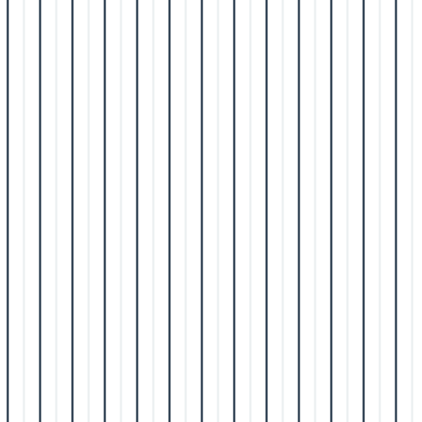 | 90 | 20 | 3 | dark blue / light grey |
| awning | 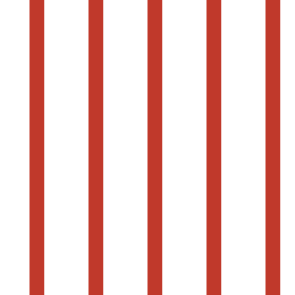 | 90 | 30 | 30 | red / white |
| nautical |  | 0 | 16 | 8 | dark blue / white |
| candy | 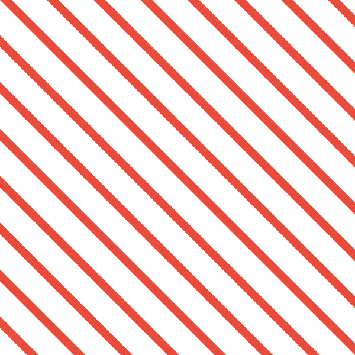 | 45 | 14 | 14 | red / white (4-color) |
| barber-pole | 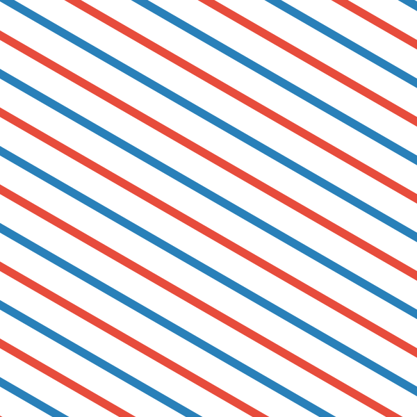 | 30 | 12 | 12 | red / white / blue / white |

### Dot (6)

| Preset | Preview | Spacing | Radius | Hex Offset | Colors |
|--------|---------|---------|--------|------------|--------|
| polka-small | 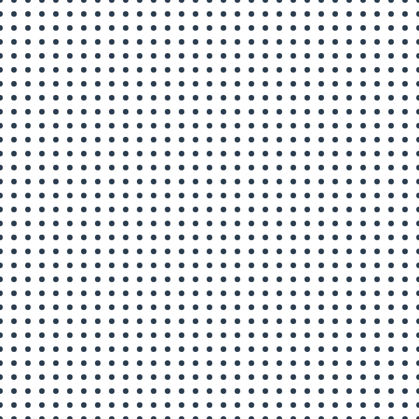 | 20 | 4 | no | dark / white bg |
| polka-large | 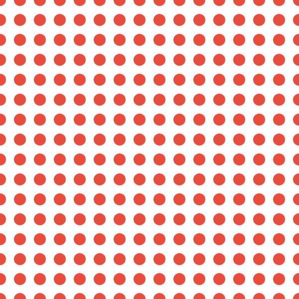 | 40 | 12 | no | red / white bg |
| halftone | 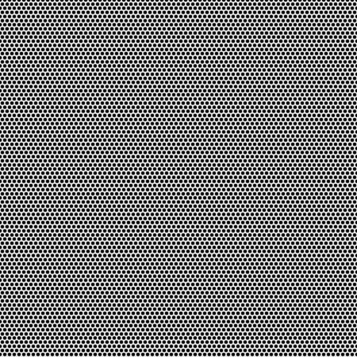 | 8 | 3 | yes | black / white bg |
| hex-dot | 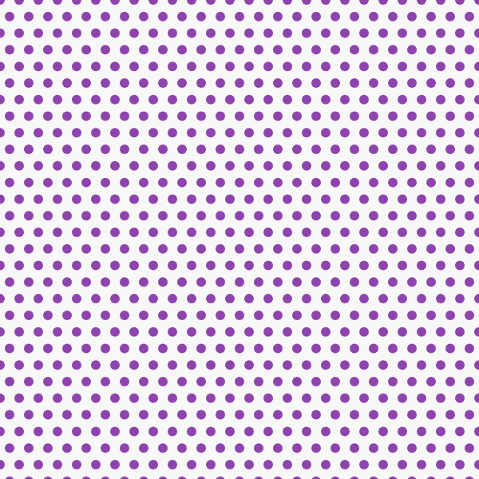 | 24 | 6 | yes | purple / light bg |
| confetti | 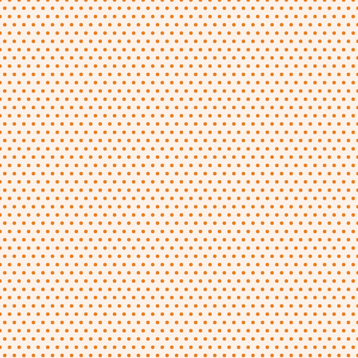 | 16 | 3 | yes | orange / cream bg |
| sprinkle | 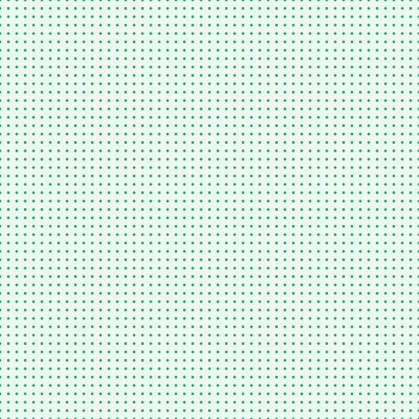 | 12 | 2 | no | green / mint bg |

### Checker (5)

| Preset | Preview | Cell Size | Angle | Colors |
|--------|---------|-----------|-------|--------|
| checker-small | 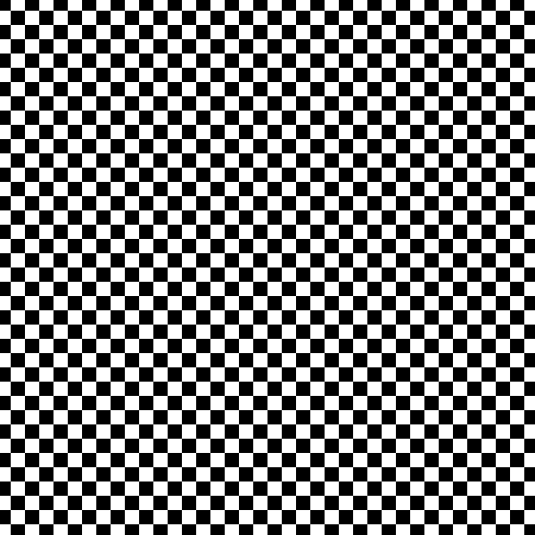 | 16 | 0 | black / white |
| checker-large | 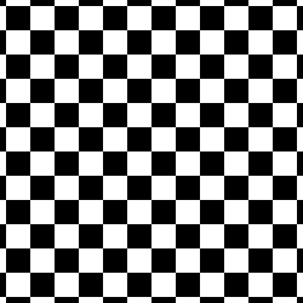 | 48 | 0 | black / white |
| gingham | 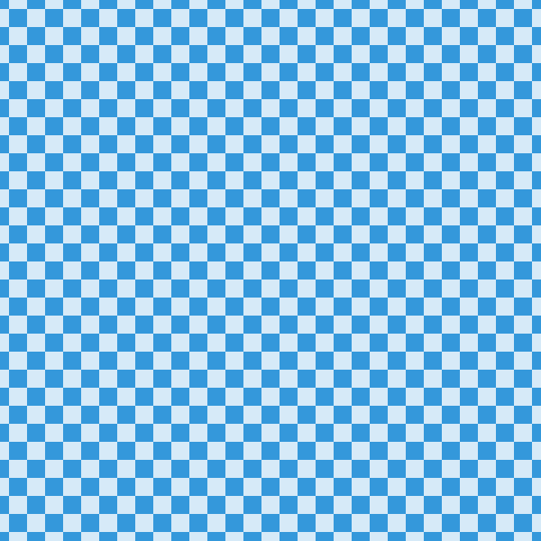 | 20 | 0 | blue / light blue |
| buffalo-check | 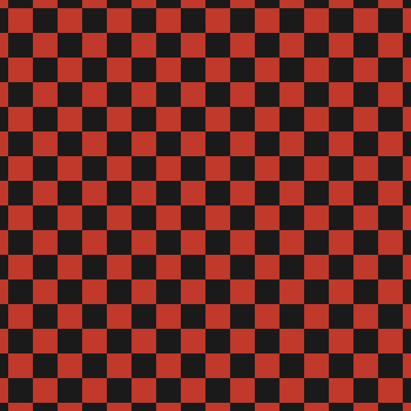 | 36 | 0 | red / dark |
| houndstooth | 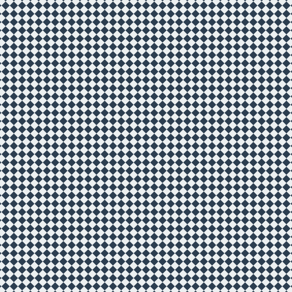 | 12 | 45 | dark blue / light |

### Wave (5)

| Preset | Preview | Amplitude | Frequency | Waveform | Color |
|--------|---------|-----------|-----------|----------|-------|
| gentle-wave |  | 12 | 2 | sine | blue |
| choppy | 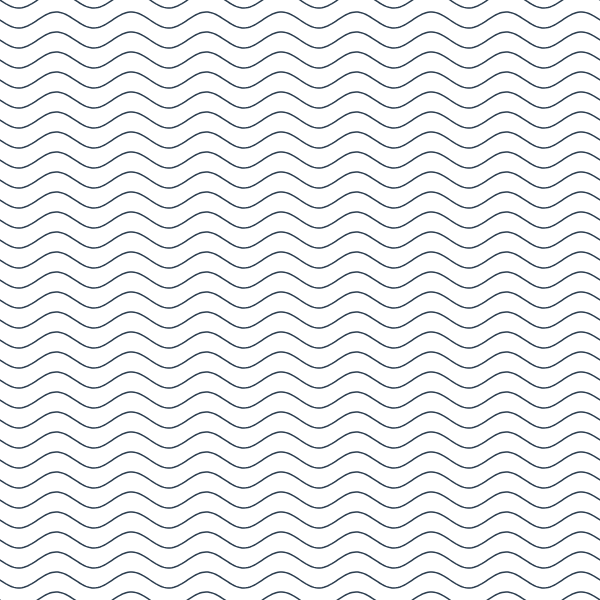 | 8 | 8 | sine | dark |
| zigzag | 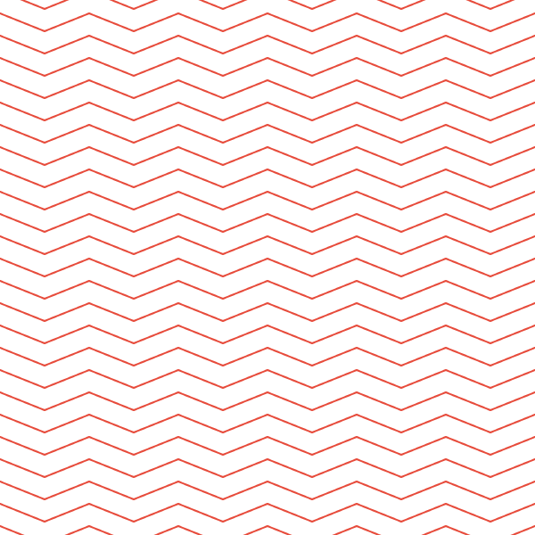 | 10 | 6 | triangle | red |
| scallop | 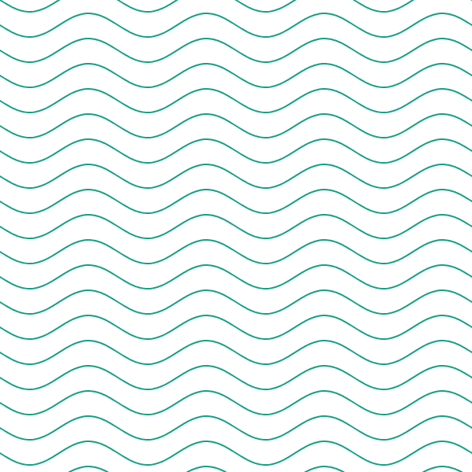 | 15 | 4 | sine | teal |
| ogee | 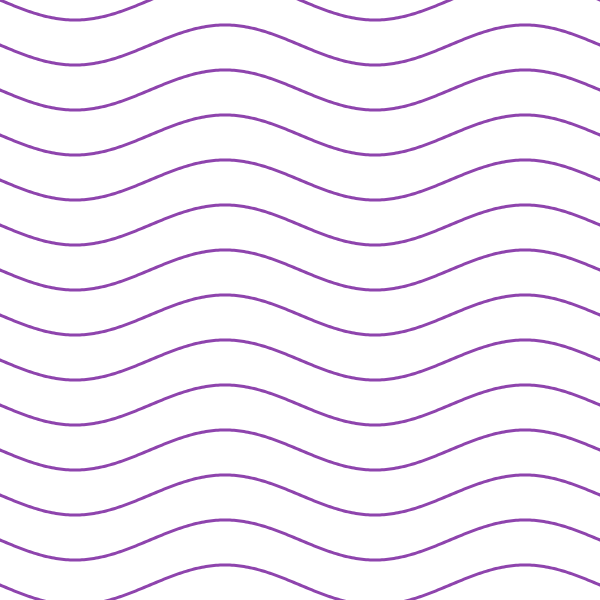 | 20 | 2 | sine | purple |

### Fill (9)

| Preset | Preview | Strategy | Line Width |
|--------|---------|----------|------------|
| hatch-light | 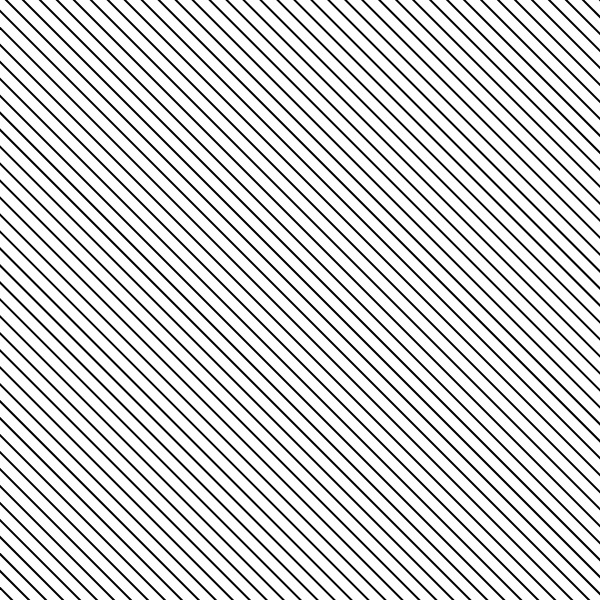 | hatch 45° sp:12 | 2 |
| hatch-medium | 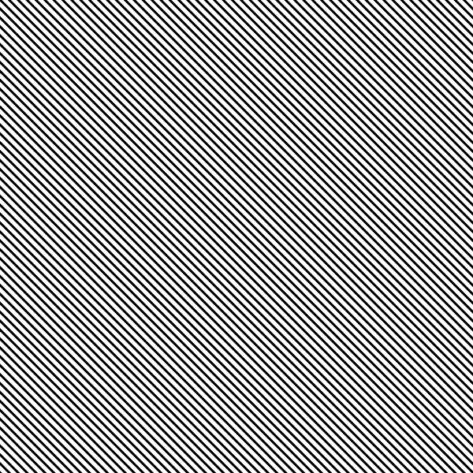 | hatch 45° sp:8 | 3 |
| hatch-dense | 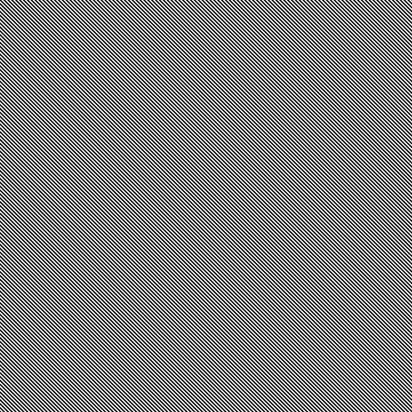 | hatch 45° sp:4 | 2 |
| crosshatch-light | 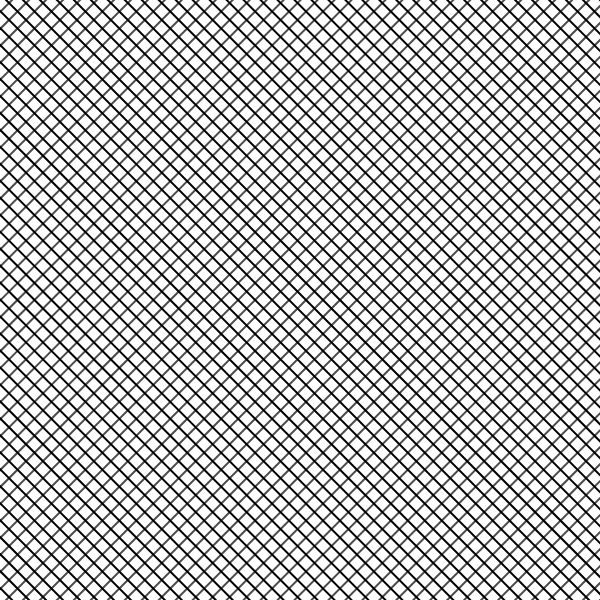 | crosshatch 45°/135° sp:12 | 2 |
| crosshatch-dense | 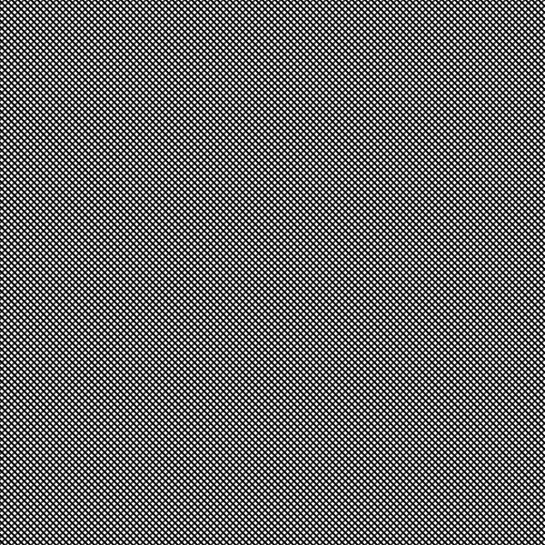 | crosshatch 45°/135° sp:5 | 2 |
| stipple-light | 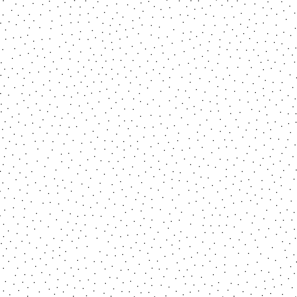 | stipple density:15 poisson | 2 |
| stipple-dense | 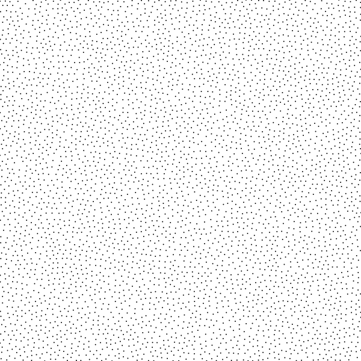 | stipple density:60 poisson | 2 |
| scumble | 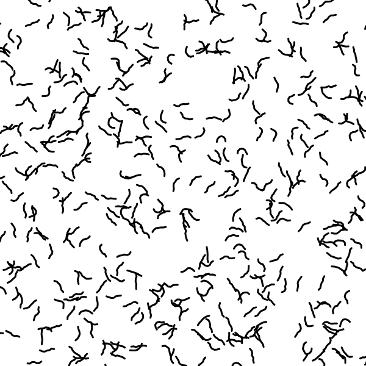 | scumble density:12 | 3 |
| contour |  | contour sp:6 smooth:0.3 | 2 |

## Usage

```typescript
import patternsPlugin from "@genart-dev/plugin-patterns";

// Access layer types
const stripe = patternsPlugin.layerTypes.find(lt => lt.typeId === "patterns:stripe");

// Access presets
import { getGeometricPreset, getPatternPreset } from "@genart-dev/plugin-patterns";

const awning = getGeometricPreset("awning");
// { layerType: "patterns:stripe", angle: 90, spacing: 30, lineWidth: 30, colors: ["#c0392b", "#ffffff"] }

const hatchLight = getPatternPreset("hatch-light");
// { strategy: { type: "hatch", angle: 45, spacing: 12 }, lineWidth: 2 }
```

## Examples

The `examples/` directory contains 31 `.genart` files (one per preset) with matching `.png` thumbnails. Open `examples/patterns-gallery.genart-workspace` to view all presets in a grid layout.

To re-render thumbnails:

```bash
node render-examples.cjs
```

## License

MIT
